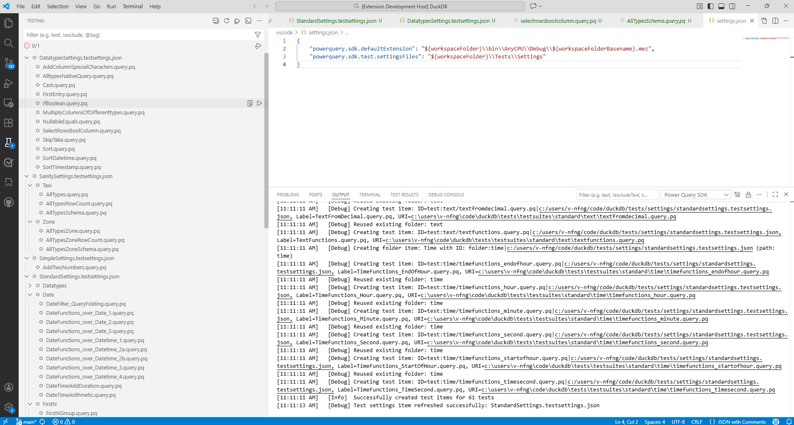
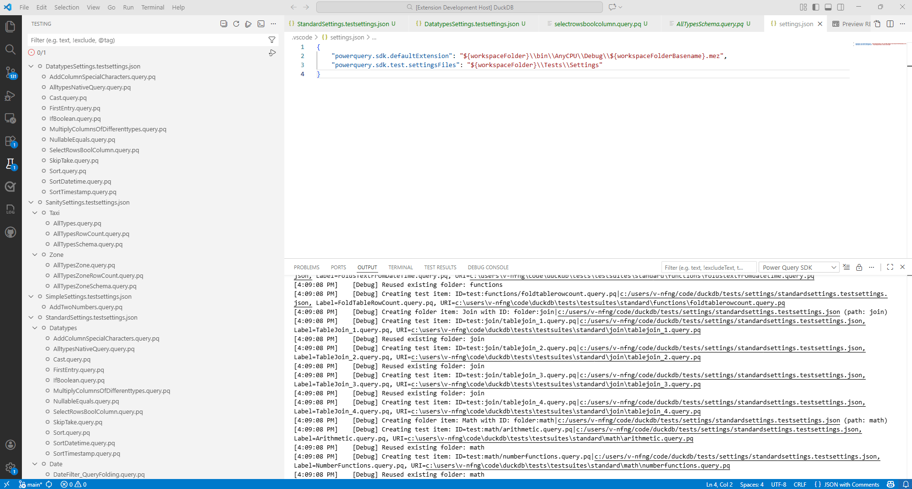
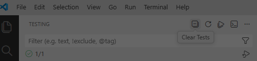
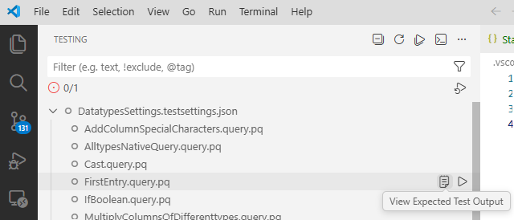

# Power Query SDK - Test Explorer Integration 

The Power Query SDK for Visual Studio Code now includes integrated support for discovering and running Power Query connector tests directly within the VS Code Test Explorer UI.  

### Overview

**With the integrated Test Explorer support, you can:**
- Discover and run Power Query tests directly from the VS Code Test Explorer
- Organize tests using your own folder structure and see that structure mirrored in the Test Explorer
- View real-time test results, including detailed output and diffs for failures
- Filter, group, and run tests at any level (all, folder, or individual test)
- See instant UI updates in the Test Explorer to reflect test settings changes

It uses a test settings file(s)-driven approach, where you define the path to your test files and test run configurations (see the [About `.testsettings.json` (Test Settings File)](#about-testsettingsjson-test-settings-file) for more info). It builds on the native [VS Code Testing API](https://code.visualstudio.com/api/extension-guides/testing) to provide the necessary testing features.

Tests are displayed in the VS Code Test Explorer as “test items”: objects that represent individual tests or groups of tests (Learn more about test items and the VS Code Testing API [here](https://code.visualstudio.com/api/extension-guides/testing).)

*Test Explorer with some sample discovered tests and hierarchical test items.*



## Quick Start

### Prerequisites

- Visual Studio Code version 1.100 or later.
- `Microsoft.PowerQuery.SdkTools` NuGet package version `2.150.3` or later.

<a id="quick-start-steps"></a>
### Steps

**Tip:** If you already have the Power Query SDK extension installed in your default VS Code profile, you can create a new [VS Code profile](https://code.visualstudio.com/docs/configure/profiles) to test this version in isolation without affecting your existing setup.

1. Build this Power Query SDK extension (includes the integrated Test Explorer support) by `npm run vsix` and install the generated .vsix file by running `code --install-extension <path_to_vsix>` in your terminal.
2. Make sure your workspace contains one or more `.testsettings.json` files. See [About `.testsettings.json`](#about-testsettingsjson-test-settings-file) for details.
3. Specify the required configurations (see the [Configuration](#configuration) section below).
4. Open the Test Explorer view in VS Code.
5. Expand a test settings item to discover its corresponding tests.
6. Run tests by clicking the Run button at any level (all tests, a test settings group, a folder, or an individual test).
7. View results and output in the Test Explorer and Test Results window.

### Configuration

To enable the Test Explorer to find and run your tests, you need to configure specific test settings file(s) and your VS Code workspace settings.

1. Open your settings in VS Code.
    * **Workspace Settings** (for project-specific paths): Open the Command Palette (**Ctrl+Shift+P** or **Cmd+Shift+P**), type **Preferences: Open Workspace Settings (JSON)** and select it.
    * **User Settings** (for global paths): Open the Command Palette, type **Preferences: Open User Settings (JSON)** and select it.

2. Add the following configurations. Note that **relative paths are resolved relative to the workspace folder**.

   * `powerquery.sdk.test.settingsFiles`: Path(s) to your `.testsettings.json` file(s) or a directory containing them. Accepts:
     * A string path to a directory (all valid `.testsettings.json` files inside will be used)
     * A string path to a single test settings file
     * An array of string paths to individual test settings files/directory containing them
   * `powerquery.sdk.test.ExtensionPaths`: Path(s) to your connector file(s) (`.mez` files). Accepts:
     * A string path to a single connector file
     * An array of string paths to multiple connector files
     * Supports VS Code variable substitution (e.g., `${workspaceFolder}`)
     * If not provided or empty, falls back to `powerquery.sdk.defaultExtension` (which only supports a single path)
   * `powerquery.sdk.tools.location`: The absolute path to the PQTest installation folder (containing `PQTest.exe`). **Requires Microsoft.PowerQuery.SdkTools version 2.150.3 or later.** This setting can be defined in either **User** or **Workspace** settings.
     * Example:
       ```json
       "powerquery.sdk.tools.location": "C:\\...\\Microsoft.PowerQuery.SdkTools.2.150.4\\tools",
       "powerquery.sdk.tools.version": "2.150.4"
       ```

   > You can use variables like `${workspaceFolder}` to make paths relative to your project root. Relative paths in `settings.json` are resolved relative to the workspace root.

3. Set up connector credentials as described [here](https://learn.microsoft.com/en-us/power-query/power-query-sdk-vs-code#set-credential).


### About `.testsettings.json` (Test Settings File)

A `.testsettings.json` file is a JSON configuration file that defines how your Power Query connector tests are discovered and run. It follows the same format as the `settings.json` file supported by the PQTest framework, and includes all the options required for a test run (such as test directories, diagnostics folder path, and other settings). You can create this file manually or by copying and modifying an existing PQTest supported `settings.json` file. 

**Important:** Paths specified within the `.testsettings.json` file (such as `QueryFilePath`, `DiagnosticsPath`, etc.) are expected to be relative to the location of the settings file itself. This aligns with how PQTest's `run-compare` command resolves paths.


During test execution, this file is passed to PQTest using the `--settingsFile` flag (e.g., `PQTest.exe run-compare --settingsFile <path-to-your-testsettings.json>`).


### Test Discovery & Auto-Sync

The extension provides both manual and automatic ways to keep your Test Explorer in sync with your project.

> **Terminology:**
> - **Discover/Rediscover**: Scanning settings files to find and list available tests.
> - **Refresh**: Manually or automatically updating the test list.
> - **Sync**: Keeping the Test Explorer view up-to-date with file system changes.

#### Manual Refresh

If you add new tests, change settings, or if test discovery fails, you can manually trigger a refresh:

* **Refresh All Tests**: Click the **Refresh All Tests** button (circular arrow icon) at the top of the Test Explorer pane to rediscover tests for all settings files.

   *Discovering tests for all settings files using the Refresh Tests button at the top of the Test Explorer.*

   

* **Refresh Tests referred by a Test Settings file**: Hover over a specific test settings file and click the **Refresh Tests** button (circular arrow icon) to rediscover tests for just that file.

   *Rediscovering tests for a sample settings file using the "Refresh Tests" button in the Test Explorer.*

   

#### Automatic Sync (Watchers)

The extension automatically watches specific files and configurations to keep the Test Explorer in sync with your workspace.

The `powerquery.sdk.test.settingsFiles` configuration determines the scope of what the extension monitors. Changes to this setting or the files it references will trigger automatic updates.

**1. Configuration Changes**
*   **Trigger:** Modifying the `powerquery.sdk.test.settingsFiles` configuration in VS Code settings.
*   **Action:** A full test reset is triggered. All tests are cleared, and valid `.testsettings.json` files are rediscovered based on the updated path(s). 

**2. Test Settings File Changes**
*   **File Edits:** Saving changes to a `.testsettings.json` file automatically refreshes the tests defined within it (provided the item is currently expanded in the Test Explorer).
*   **File Creation/Deletion:** Creating or deleting `.testsettings.json` files within the directories specified in your `powerquery.sdk.test.settingsFiles` configuration will automatically update the list of test settings items in the explorer.


> **Limitation:** The extension **does not** watch individual `.query.pq` files.
> If you add, remove, or rename a query file in your test folder without modifying the settings file, the Test Explorer will not automatically update.
>
> **Workaround:** You must either manually click "Refresh" or make a trivial change (like adding a space) to the `.testsettings.json` file to trigger the auto-sync.


### Clearing Tests

You can clear all discovered tests and collapse all settings items by clicking the **Clear Tests** button (clear icon) at the top of the Test Explorer pane.

*Clearing all tests using the Clear Tests button at the top of the Test Explorer.*




> **Note:** After clearing all tests, the expansion and collapse functionality for test settings items may be inconsistent. For reliable usage, use the **Refresh Tests** button to rediscover tests.


### View Expected Output

You can quickly view the expected output file (`.pqout`) for any test. To do this, either click the **View Expected Test Output** icon (clipboard) that appears when hovering over a test, or right-click the test item and select **View Expected Test Output** from the context menu. This action opens the corresponding `.pqout` file in the editor.

*Viewing an expected test output (.pqout) file from VS Code Test Explorer.*



### Diff View for Failures

If a test fails because the output didn't match the expected result, the Test Explorer provides a built-in diff view. Click on the failure in the Test Results pane to see a side-by-side comparison of the **Actual** vs. **Expected** output.

*Test Results pane showing detailed output and a side-by-side diff for some sample failed tests.*


### Query Folding Diagnostics

If your test configuration enables query folding validation (by specifying a `DiagnosticsPath`), the extension also compares the generated diagnostics against the expected baseline.

If a test fails due to a diagnostics mismatch, you can view the diff between the **Actual** and **Expected** diagnostics files by clicking on the failure in the Test Results pane.

   *Diff view in Test Explorer showing actual vs expected diagnostics for a failed test.*

   


### Known Issues

- **Test Explorer Focus Grabbing:** During test discovery or refreshing all tests, the Test Explorer view may repeatedly grab focus, interrupting navigation to other views. This issue will be prioritised in future releases.
- **Failed Test Selection Sync:** Clicking a failed test in the Test Explorer does not always highlight the corresponding test in the Test Results pane, unlike passed tests. This issue will be prioritised in future releases.
- **Discovery Failures:** If discovery fails for a specific settings items (e.g. tests don't appear after expanding), use the **Refresh Tests** button inline with that item to retry.


### Intermediate Test Results & Cleanup

The Test Explorer automatically persists intermediate test results (.pqout files) during test runs to improve performance and debugging. You will see two related arguments in the executed PQTest command:

- `--persistIntermediateTestResults`: Always enabled to force persistence of test results.
- `--intermediateTestResultsFolder <path>`: Specifies where these artifacts are stored.

**Storage Location**

By default, these results are stored in a `../TestResults` folder relative to your `.testsettings.json` file. You can customize this location:
1.  Set `powerquery.sdk.test.defaultIntermediateResultsFolder` in your VS Code settings. OR
2.  Add the `"IntermediateTestResultsFolder": "<path>"` key to your `.testsettings.json` file. Applies to only that settings file's run.

**Automatic Cleanup**

To save disk space, the extension automatically deletes old test results from the default `../TestResults` folder.
- **Frequency**: Runs in the background when executing tests (throttled to run at most once every 4 hours).
- **Configuration**: Use `powerquery.sdk.test.cleanupIntermediateResultsAfterHours` to control the file retention period (default: 24 hours). Set to `0` to disable.
- **Note**: Automatic cleanup **only** applies to the default `../TestResults` location. If you use custom paths, you are responsible for cleaning up those folders.


### Logging & Troubleshooting

- Extension logs are available in the `Power Query SDK` output channel. For unexpected behaviors, look for the `PQTest run-compare` entry in the logs to verify the command arguments and execution. This helps identify whether the issue is with the extension (e.g. incorrect paths) or PQTest itself.

   *Sample log output showing the PQTest execution command.*
   

   ```text
   Executing: C:\...\PQTest.exe run-compare --extension <path_to_extension> --settingsFile <path_to_settings> ...
   ```

   **Debugging "Unknown Error Occurred":**

   Currently, `PQTest run-compare` may suppress error details for certain failures, returning only "Unknown Error". To view detailed error messages:

   1. Copy the executed PQTest run-compare command from the [output logs](#logging--troubleshooting).
   2. Replace `run-compare` with `compare`.
   3. Run the command in a terminal. **Note:** Navigate to the folder containing your `.testsettings.json` file first, as paths in the settings file are relative to its location.
- Common issues:

   - **PQTest.exe not found:** Ensure the `powerquery.sdk.tools.location` setting points to the correct absolute path of the PQTest installation folder.
   - **Invalid QueryFilePath:** Ensure `QueryFilePath` in your settings file points to a directory or `.query.pq` file.
   - **No tests found:** Ensure `QueryFilePath` points to a valid directory.
   - **Expanding a settings file does nothing:** Use the "Refresh Tests" command (refresh icon inline with a settings item) to refresh tests.
