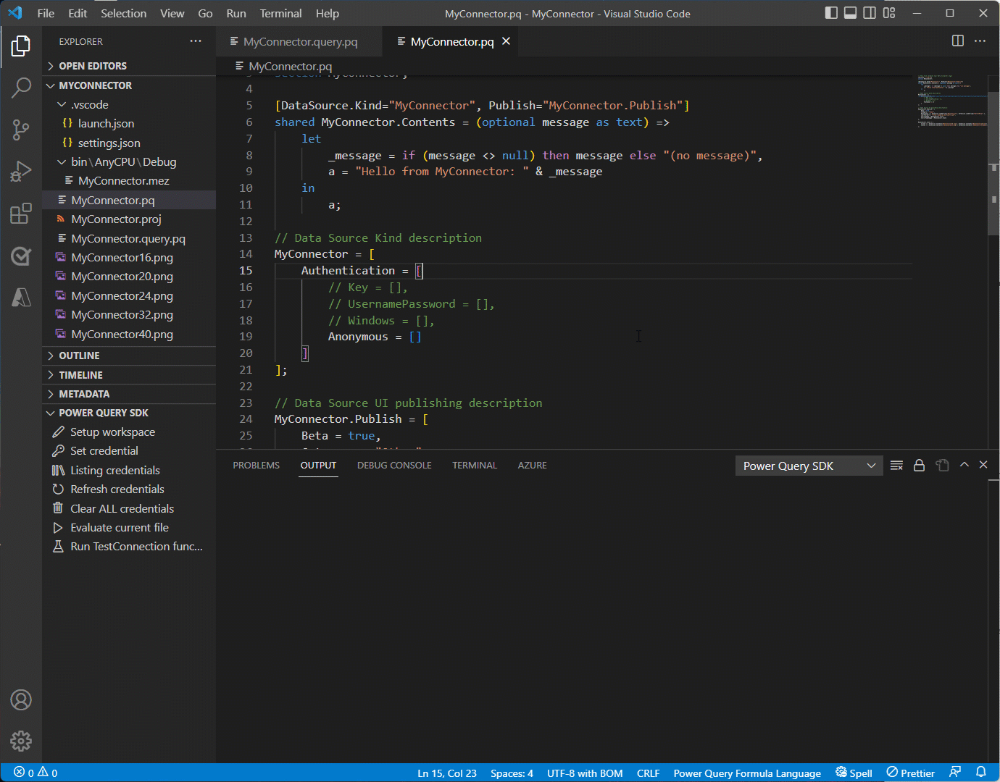

# Power Query Connector SDK for Visual Studio Code

> **_NOTE:_**  The Power Query SDK extension for Visual Studio Code is currently in Public Preview. You can learn more about this extension and the development of Power Query data connectors from the link [aka.ms/PowerQuerySDKDocs](https://aka.ms/PowerQuerySDKDocs).

Provides functionality related to the development and testing of Custom Connectors for Power Query and Power BI.

Install the latest version of the [Power Query SDK through the Visual Studio Code Marketplace](https://aka.ms/PowerQuerySDK).

> **_NOTE:_**  You can learn how to manually build and install this project from the article on [build and install](build.md).

## Features

What you can do with this extension:

* Create a new extension project using a custom connector template
* Build connector file (.mez)
* Set and manage credentials
* Run test queries
* Test your TestConnection function for refresh on the cloud
* View query results
* Leverage syntax highlighting and intellisense for writing M script
* Manage your workspace settings and other project-level configurations

## Related projects

[vscode-powerquery](https://github.com/microsoft/vscode-powerquery)

## Contributing

This project welcomes contributions and suggestions. Most contributions require you to agree to a
Contributor License Agreement (CLA) declaring that you have the right to, and actually do, grant us
the rights to use your contribution. For details, visit <https://cla.opensource.microsoft.com>.

When you submit a pull request, a CLA bot will automatically determine whether you need to provide
a CLA and decorate the PR appropriately (e.g., status check, comment). Simply follow the instructions
provided by the bot. You will only need to do this once across all repos using our CLA.

This project has adopted the [Microsoft Open Source Code of Conduct](https://opensource.microsoft.com/codeofconduct/).
For more information see the [Code of Conduct FAQ](https://opensource.microsoft.com/codeofconduct/faq/) or
contact [opencode@microsoft.com](mailto:opencode@microsoft.com) with any additional questions or comments.

## Trademarks

This project may contain trademarks or logos for projects, products, or services. Authorized use of Microsoft
trademarks or logos is subject to and must follow
[Microsoft's Trademark & Brand Guidelines](https://www.microsoft.com/en-us/legal/intellectualproperty/trademarks/usage/general).
Use of Microsoft trademarks or logos in modified versions of this project must not cause confusion or imply Microsoft sponsorship.
Any use of third-party trademarks or logos are subject to those third-party's policies.

## Support and issues

Before creating a new issue or discussion, please make sure to the read our [support](SUPPORT.md) article for guidelines.

